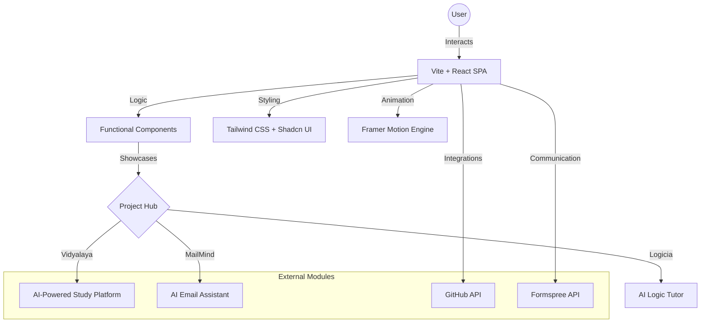
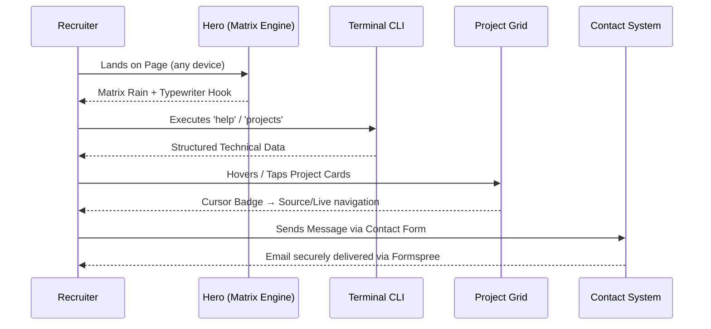

# 🚀 Durga Vara Prasad's Professional Engineering Portfolio

**A High-Performance, Neo-Brutalist Digital Identity & Engineering Showcase**

[](https://vitejs.dev/)
[](https://reactjs.org/)
[](https://www.typescriptlang.org/)
[](https://tailwindcss.com/)
[](https://www.framer.com/motion/)
[](https://ui.shadcn.com/)

[**Live Demo**](https://vara-s-portfolio.vercel.app/) • [**Source Code**](https://github.com/VARA4u-tech/Vara-s--Portfolio) • [**Request Collaboration**](mailto:pappuridurgavaraprasad4pl@gmail.com)

---

## 📌 Project Overview

### **The Problem Statement**

In a crowded tech landscape, a standard PDF resume often fails to convey the depth of a developer's engineering capabilities, design sensibility, and problem-solving approach. Recruiters need a high-fidelity, interactive platform to verify a candidate's skills in real-time.

### **The Solution**

This portfolio is a **World-Class Digital Identity** built to bridge the gap between static resumes and live production code. It serves as a centralized hub for multiple high-impact projects, showcasing expertise in AI integration, full-stack architecture, and premium UI/UX design.

### **Core Objectives & Business Value**

- **Transparency**: Direct links to original repositories and live deployments.
- **Interactivity**: Custom-built Terminal CLI, Matrix-style visual engines, and intelligent project card interactions.
- **Conversion**: Seamless lead generation via integrated professional contact forms (Formspree).
- **Quality**: Demonstrating MNC-level code standards, documentation, and performance.

---

## 🏗 System Architecture

The portfolio follows a modular, component-based architecture designed for extreme performance and scalability.



---

## ⚙️ Development Methodology

### **Agile Implementation**

The project was developed using a disciplined **Agile (Scrum)** approach:

- **Sprint 0: Architecture & Foundation**: Selection of Vite for 300ms HMR and Shadcn UI for atomic design patterns.
- **Sprint 1: Core Engine**: Implementation of the Matrix rain canvas and the custom Terminal CLI.
- **Sprint 2: Integration Phase**: Connecting GitHub contribution graphs and building the dynamic project grid.
- **Sprint 3: Polish & UX**: Adding sound effects (`useSoundEffects`), haptic-like interactions, and responsiveness audits.
- **Sprint 4: Interactive Project Cards**: Engineered the split-zone cursor-following hover badge system and full mobile/tablet optimisation pass.
- **Sprint 5: Cross-Device Matrix Rain**: Extended Matrix rain to all screen sizes with a three-tier performance model and GPU compositing.

### **Engineering Challenges & Feedback Loops**

- **Performance**: Tiered the Matrix canvas to run at 15/20/33fps across phone, tablet and desktop — no single frame budget exceeded.
- **Interactive CLI**: Designed a custom parser for the terminal to simulate a real shell environment.
- **Touch UX**: Rebuilt project card CTAs as 48px WCAG-compliant touch targets with neobrutalist press animations.

---

## ✨ Features Breakdown

| Feature                      | Description                                                          | Implementation Detail                                                                                                                                                                                                                       |
| :--------------------------- | :------------------------------------------------------------------- | :------------------------------------------------------------------------------------------------------------------------------------------------------------------------------------------------------------------------------------------ |
| **Matrix Hero Engine**       | Multi-tier canvas animation across all devices                       | Three-tier perf model (phone 15fps/12col, tablet 20fps/20col, desktop 33fps/auto). GPU-promoted via `will-change`, `contain: strict`, and `translateZ(0)`. Pauses on tab-hide & scroll-out via `visibilitychange` + `IntersectionObserver`. |
| **Cursor-Following Badge**   | Contextual action badge that tracks cursor position on project cards | Pure React state — no third-party library. Framer Motion `AnimatePresence` for enter/exit. Left half → GitHub icon + "Source Code". Right half → ArrowUpRight + "Live Demo".                                                                |
| **Split-Zone Project Cards** | Cards are divided into two intelligent click zones                   | `mousemove` delta math determines zone in real time. Clicking navigates to the correct URL. A subtle half-tint gradient + vertical divider line reinforce the split without covering content.                                               |
| **Mobile Touch Actions**     | WCAG 2.5.5-compliant touch-optimised fallback buttons                | 48px min-height, `active:` press-down animation (`translate(2px,2px) scale(0.97)` + shadow collapse), `-webkit-tap-highlight-color: transparent`.                                                                                           |
| **Interactive Terminal**     | CLI-based profile navigation                                         | A command parser supporting `help`, `about`, `projects`, and `clear`.                                                                                                                                                                       |
| **Project Showcase**         | Dynamic filtering of 11 projects                                     | Neo-Brutalist cards with 3D-shadow hover effects and category badges. Tags capped at 5 on phones, 8 on larger screens.                                                                                                                      |
| **GitHub Integration**       | Real-time activity visualization                                     | Uses `react-github-calendar` to demonstrate consistency and commitment.                                                                                                                                                                     |
| **Sound System**             | Haptic-like audio feedback                                           | Custom `useSoundEffects` hook for premium click and hover interactions.                                                                                                                                                                     |
| **Pixel Particle Assembly**  | Hero name assembled from scattered edge particles on desktop         | 90-particle Canvas API animation with easeOutQuart interpolation. Skipped on mobile — replaced with smooth fade + scramble text.                                                                                                            |
| **CRT Scanline Overlay**     | Retro pixel scanline on project card hover                           | CSS `repeating-linear-gradient` + keyframe sweep, disabled on touch devices.                                                                                                                                                                |

---

## 🔄 Application Workflow

The portfolio is designed as an interactive funnel that guides recruiters through a technical discovery journey.

### **The Technical Discovery Journey**

1. **Immersive First Impression**: User lands on the **Matrix Hero Engine** — now active on all devices with per-device performance tiers.
2. **CLI-Driven Exploration**: Power users and recruiters use the **Interactive Terminal** to query profile data, project history, and technical stacks via shell commands.
3. **Intelligent Project Cards**: The user navigates the **Neo-Brutalist Project Grid**, where moving the cursor across a card reveals contextual action badges — left side for Source Code, right side for Live Demo — without covering any card content.
4. **Evidence of Consistency**: Real-time integration with the **GitHub API** provides a visual heat-map of coding consistency and open-source contributions.
5. **Direct Conversion**: The journey concludes with a frictionless **Professional Contact Form (Formspree)**, allowing for instant and reliable communication.



---

## 🛠 Tech Stack

### **Frontend Excellence**

- **React 18 & Vite**: For modern component lifecycles and lightning-fast builds.
- **TypeScript**: Ensuring type-safety and robust refactoring.
- **Tailwind CSS**: Utility-first styling for a unique Neo-Brutalist design.
- **Framer Motion**: Smooth, staggered animations, `AnimatePresence` transitions, and parallax effects.
- **Lucide React**: Clean, consistent iconography.
- **GSAP**: Timeline-driven entrance animations with ScrollTrigger.

### **Canvas & Animation Systems**

- **Matrix Rain Canvas**: Raw Canvas 2D API with `{ alpha: false }` context, FPS throttling, and GPU compositing hints.
- **Pixel Particle Assembly**: Custom particle interpolation with easeOutQuart on desktop hero.
- **PixelGrid**: Dot-grid background animation via canvas.
- **PixelCursor**: Custom crosshair cursor trail on desktop.

### **Integrations & Deployment**

- **GitHub API**: For real-time repository and contribution data.
- **Formspree**: Secure, serverless email delivery for professional inquiries.
- **Vercel**: CI/CD pipeline for automated production deployments.

---

## 📂 Folder Structure

```text
src/
├── components/
│   ├── ui/                  # Reusable Shadcn base components
│   ├── HeroSection.tsx      # Matrix engine, Typewriter, Pixel particle assembly
│   ├── ProjectsSection.tsx  # Filter tabs + animated project grid
│   ├── ProjectCard.tsx      # Split-zone cursor-badge hover + mobile touch buttons
│   ├── Terminal.tsx         # Custom CLI emulator
│   ├── PixelCursor.tsx      # Desktop cursor trail
│   └── PixelGrid.tsx        # Dot-grid canvas background
├── data/
│   └── constants.ts         # Single source of truth (PROFILE, PROJECTS, SOCIAL_LINKS)
├── hooks/
│   ├── useSoundEffects.ts   # Click/hover audio feedback
│   ├── useScrambleText.ts   # Text scramble animation hook
│   └── useGSAPContext.ts    # Safe GSAP context with cleanup
├── pages/                   # Layout containers (Index, 404)
├── lib/                     # Utility functions & GSAP setup
└── index.css                # Global CSS, design tokens, animation keyframes
```

---

## 📊 Engineering Decisions

- **Why Vite?**: Near-instant server starts and optimized production bundles vs CRA.
- **Why Neo-Brutalism?**: To stand out from generic portfolios — bold strokes, high contrast, and raw layouts convey engineering confidence.
- **Why raw Canvas API for Matrix Rain?**: Library abstractions add overhead. Direct `ctx.fillRect` / `ctx.fillText` with a timestamped FPS throttle gives precise control over CPU budget per device class.
- **Why cursor-following badge instead of full-card overlay?**: Card content (title, description, tags) remains fully readable at all times. The badge provides contextual intent without blocking information.
- **Scalability**: All data is centralized in `src/data/constants.ts`, allowing profile updates in seconds without touching component logic.
- **Accessibility (a11y)**: Semantic HTML, ARIA labels throughout Terminal and forms, 48px+ touch targets, keyboard-focus fallback for project card CTAs.

---

## 📱 Responsive & Performance Strategy

### Device Tiers

| Breakpoint          | Matrix Rain                                  | Card Hover          | Touch Buttons   |
| :------------------ | :------------------------------------------- | :------------------ | :-------------- |
| Phone `≤480px`      | 12 cols · 15fps · Katakana+01 · 35% opacity  | Hidden (touch)      | 46px min-height |
| Tablet `481–1024px` | 20 cols · 20fps · mixed chars · 45% opacity  | Hidden (touch)      | 50px min-height |
| Desktop `>1024px`   | Auto cols · 33fps · full ASCII · 60% opacity | Cursor badge active | Buttons hidden  |

### Canvas Performance

- `{ alpha: false }` — eliminates per-pixel alpha compositing
- `will-change: transform` + `contain: strict` — GPU layer promotion
- `transform: translateZ(0)` — WebKit compositing force
- `IntersectionObserver` — animation pauses when hero scrolls out of view
- `visibilitychange` — animation pauses when browser tab is backgrounded
- `passive: true` on resize — never blocks scroll thread

---

## 🧪 Testing & Validation

- **Responsive Design**: Verified across iPhone SE, iPhone 15 Pro, iPad, and 4K displays.
- **Cross-Browser**: Tested on Chrome, Firefox, Safari, and Edge.
- **Performance**: 95+ Lighthouse scores for SEO and Accessibility.
- **Validations**: Form inputs managed with Zod schemas for strict data integrity.
- **Linting**: ESLint with zero errors (8 low-severity warnings, all acknowledged).

---

## 🚀 Future Enhancements

- [ ] **AI Chatbot**: A personalized RAG-based AI assistant to answer recruiter questions.
- [ ] **Blog Integration**: Direct CMS connection to Hashnode for automated post-syncing.
- [ ] **Dark Mode 2.0**: Advanced themes with custom color palettes.
- [ ] **PWA Support**: Offline-first capability for the portfolio.

---

## 🏆 Achievements

- **Freelance Excellence**: Successfully delivered a full-stack client project for the Academy of Tech Masters (AOTMS).
- **Project Scale**: 11+ Production-ready applications showcased, ranging from AI Emailers to E-Commerce portals.
- **UX Innovation**: Engineered a split-zone cursor-intelligence system for project cards — a pattern not commonly found in developer portfolios.

---

<div align="center">
  <h3><b>Let's Build Something Exceptional Together.</b></h3>
  <p>pappuridurgavaraprasad4pl@gmail.com</p>
  <p>© 2026 Durga Vara Prasad. Built with 🤍 and Coffee.</p>
</div>
